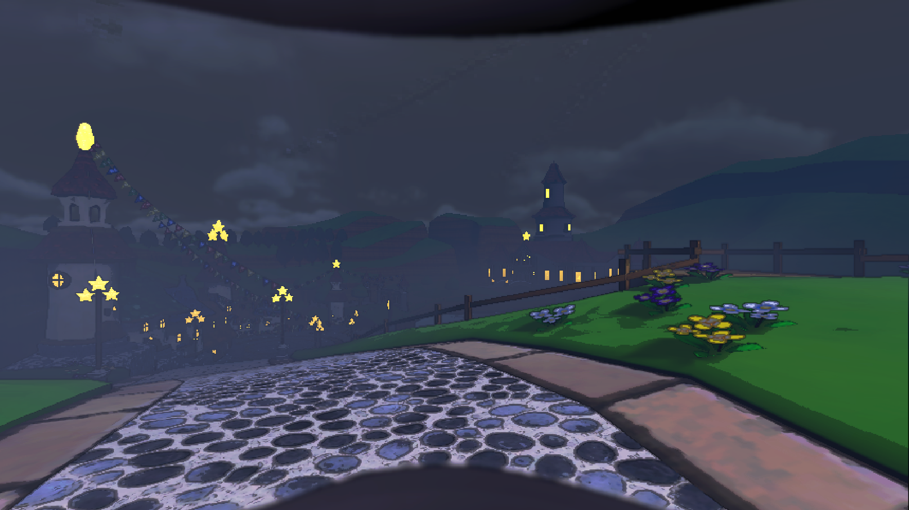

# The Star Festival

_Known as the most famous of all kingdoms, the Mushroom Kingdom was primarily home to the Mushroom People, also known as Toads, as well as other species. The kingdom's government used to be an established monarchy ruled by Princess Peach._

## Welcome to the Mushroom Kingdom!

This mod was made with the intent of porting the Mushroom Kingdom map from **Super Mario Galaxy**, while also adding some overall changes to the moon/game as a whole.

### ***A LITTLE HEADS UP FOR CONTENT CREATORS: THIS MOD CONTAINS SOUNDTRACK FROM "SUPER MARIO GALAXY"***

### Includes:

	
Potential spoilers for those who wish to go in blindly:

- 4 separate entrances to the main building
	- The main entrance
	- 2 common fire exits
	- A warp pipe fire exit
- 24 **custom _exclusive_** Mario themed scraps.
  	- Question Block
  	- Brick Block
  	- Coin
  	- Power Star
  	- Yoshi Egg
  	- Clock
  	- Key
  	- 6 different colored Starbits
  		- Red Starbit
  		- Yellow Starbit
  		- Green Starbit
  		- Blue Starbit
  		- Purple Starbit
  		- White Starbit
  	- 7 different Mushrooms
  		- Red Mushroom
  		- Green Mushroom
  		- Life Mushroom
  		- Bee Mushroom
  		- Boo Mushroom
  		- Rock Mushroom
  		- Spring Mushroom
  	- 3 different Flowers
  		- Fire Flower
  		- Ice Flower
  		- Cloud Flower
  	- Thwomp
- An introductory song added to the start of the moon (where the ship lands)
	- Song used: "Overture - Super Mario Galaxy" 
- New dropship including custom soundtrack and Question Blocks that store your purchased items.
	- Song used: "Mission Select - Super Mario Galaxy"
  

